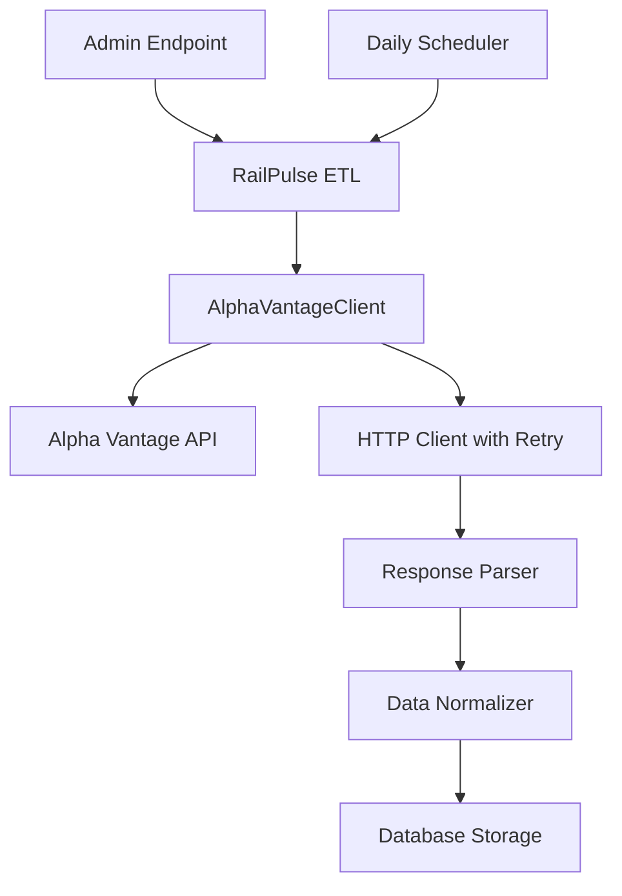

# Alpha Vantage API Integration Documentation

## Table of Contents
1. [Overview](#overview)
2. [API Setup & Configuration](#api-setup--configuration)
3. [Integration Architecture](#integration-architecture)
4. [Implementation Details](#implementation-details)
5. [Data Flow](#data-flow)
6. [Error Handling & Retry Logic](#error-handling--retry-logic)
7. [Rate Limiting & Best Practices](#rate-limiting--best-practices)
8. [Data Transformation](#data-transformation)
9. [Performance Optimizations](#performance-optimizations)
10. [Troubleshooting](#troubleshooting)
11. [Alternative Data Sources](#alternative-data-sources)

## Overview

RailPulse integrates with Alpha Vantage's REST API to fetch real-time and historical stock market data. Alpha Vantage provides comprehensive financial data including daily prices, adjusted prices, and volume information for equities, making it ideal for our financial analytics platform.

### Key Features
- **Daily Stock Prices**: OHLCV (Open, High, Low, Close, Volume) data
- **Adjusted Prices**: Corporate action adjustments (splits, dividends)
- **Compact Data**: Recent 100 data points for efficiency
- **JSON Format**: Easy-to-parse structured data
- **Free Tier**: 25 requests per day, 5 requests per minute

## API Setup & Configuration

### 1. API Key Registration
```bash
# Register at: https://www.alphavantage.co/support/#api-key
# Free tier limitations:
# - 25 requests per day
# - 5 requests per minute
# - Standard data (no premium endpoints)
```

### 2. Environment Configuration
File: `.env`
```properties
# Alpha Vantage API Configuration
ALPHAVANTAGE_API_KEY=UEX0JPTA7B692IAR

# HTTP Timeout Settings
HTTP_TIMEOUT_CONNECT=10
HTTP_TIMEOUT_READ=30
```

### 3. Application Settings
File: `app/config.py`
```python
class Settings(BaseSettings):
    alphavantage_api_key: str
    http_timeout_connect: int = 10
    http_timeout_read: int = 30
    tickers_list: List[str] = ["AAPL", "MSFT", "GOOGL"]
```

## Integration Architecture

### System Components



### File Structure
```
app/
├── etl.py                 # Main ETL orchestration
├── config.py             # Configuration management
├── db.py                 # Database operations
└── routes/
    └── admin.py          # Admin endpoints for manual triggers
```

## Implementation Details

### 1. Alpha Vantage Client Class
File: `app/etl.py`

```python
class AlphaVantageClient:
    def __init__(self):
        self.api_key = settings.alphavantage_api_key
        self.base_url = "https://www.alphavantage.co/query"
        self.session = httpx.AsyncClient(
            timeout=httpx.Timeout(
                connect=settings.http_timeout_connect,
                read=settings.http_timeout_read
            )
        )

    async def fetch_daily_data(self, symbol: str) -> Dict[str, Any]:
        """Fetch daily stock data with retry logic."""
        params = {
            "function": "TIME_SERIES_DAILY_ADJUSTED",
            "symbol": symbol,
            "apikey": self.api_key,
            "outputsize": "compact",  # Last 100 data points
            "datatype": "json"
        }
        
        url = f"{self.base_url}"
        logger.info(f"Fetching data for {symbol} from {url}")
        logger.debug(f"Request params: {params}")
        
        response = await self.session.get(url, params=params)
        response.raise_for_status()
        return response.json()
```

### 2. API Endpoint Configuration

#### Primary Endpoint
- **URL**: `https://www.alphavantage.co/query`
- **Function**: `TIME_SERIES_DAILY_ADJUSTED`
- **Method**: GET
- **Response Format**: JSON

#### Request Parameters
| Parameter | Value | Description |
|-----------|--------|-------------|
| `function` | `TIME_SERIES_DAILY_ADJUSTED` | Endpoint for daily stock data |
| `symbol` | `AAPL`, `MSFT`, `GOOGL` | Stock ticker symbol |
| `apikey` | `{YOUR_API_KEY}` | Authentication key |
| `outputsize` | `compact` | Returns last 100 data points |
| `datatype` | `json` | Response format |

#### Example Request
```http
GET https://www.alphavantage.co/query?function=TIME_SERIES_DAILY_ADJUSTED&symbol=AAPL&apikey=UEX0JPTA7B692IAR&outputsize=compact&datatype=json
```

## Data Flow

### 1. ETL Pipeline Execution
```python
async def run_etl_for_date(target_date: date) -> Dict[str, Any]:
    """Parallel ETL execution for all symbols."""
    client = AlphaVantageClient()
    symbols = settings.tickers_list  # ['AAPL', 'MSFT', 'GOOGL']
    
    # Parallel processing for performance
    tasks = [process_symbol_etl(client, symbol, target_date) for symbol in symbols]
    results = await asyncio.gather(*tasks, return_exceptions=True)
```

### 2. Single Symbol Processing
```python
async def process_symbol_etl(client: AlphaVantageClient, symbol: str, target_date: date):
    # 1. Fetch raw data from Alpha Vantage
    raw_data = await client.fetch_daily_data(symbol)
    
    # 2. Normalize data format
    normalized_rows = normalize_alpha_vantage_data(symbol, raw_data)
    
    # 3. Batch insert to database
    rows_inserted = upsert_daily_prices(normalized_rows)
    
    # 4. Calculate technical indicators
    kpis = calculate_kpis_for_symbol(symbol, target_date)
    if kpis:
        upsert_daily_metrics(kpis)
```

### 3. Response Structure
Alpha Vantage returns data in this format:
```json
{
  "Meta Data": {
    "1. Information": "Daily Prices (open, high, low, close) and Volumes",
    "2. Symbol": "AAPL",
    "3. Last Refreshed": "2025-09-13",
    "4. Output Size": "Compact",
    "5. Time Zone": "US/Eastern"
  },
  "Time Series (Daily)": {
    "2025-09-13": {
      "1. open": "222.50",
      "2. high": "224.95",
      "3. low": "221.60",
      "4. close": "222.77",
      "5. adjusted close": "222.77",
      "6. volume": "46388779",
      "7. dividend amount": "0.0000",
      "8. split coefficient": "1.0000"
    },
    // ... more dates
  }
}
```

## Error Handling & Retry Logic

### 1. Retry Decorator Implementation
```python
from tenacity import retry, stop_after_attempt, wait_exponential

@retry(
    stop=stop_after_attempt(3),
    wait=wait_exponential(multiplier=1, min=4, max=10),
    reraise=True
)
async def fetch_daily_data(self, symbol: str) -> Dict[str, Any]:
    # API call implementation
```

### 2. Common Error Scenarios

#### API Quota Exceeded
```json
{
  "Information": "Thank you for using Alpha Vantage! This is a premium endpoint. You may subscribe to any of the premium plans at https://www.alphavantage.co/premium/ to instantly unlock all premium endpoints"
}
```

**Handling:**
```python
def normalize_alpha_vantage_data(symbol: str, raw_data: Dict[str, Any]) -> List[Dict[str, Any]]:
    # Check for quota exceeded response
    if "Information" in raw_data and "premium" in raw_data["Information"]:
        logger.error(f"API quota exceeded for {symbol}")
        raise ValueError(f"Alpha Vantage API quota exceeded")
    
    # Check for valid data structure
    if "Time Series (Daily)" not in raw_data:
        logger.error(f"Unexpected response format for {symbol}. Keys: {list(raw_data.keys())}")
        raise ValueError(f"Invalid response format from Alpha Vantage")
```

#### Rate Limiting
- **Free Tier**: 5 requests per minute
- **Implementation**: Built-in delays between requests
- **Monitoring**: Log request timing and failures

### 3. Error Recovery Strategies
1. **Exponential Backoff**: Increase delay between retries
2. **Circuit Breaker**: Stop requests after consecutive failures
3. **Fallback Data**: Use cached data when API unavailable
4. **Alternative Sources**: Switch to yfinance for free data

## Rate Limiting & Best Practices

### 1. Request Throttling
```python
# Automatic throttling in parallel processing
# Each symbol gets its own HTTP connection
# Natural rate limiting through network latency
```

### 2. Efficient Data Usage
- **Compact Output**: Request only last 100 data points
- **Parallel Processing**: Fetch multiple symbols simultaneously
- **Batch Database Operations**: Minimize database round trips

### 3. Monitoring & Logging
```python
logger.info(f"Fetching data for {symbol} from {url}")
logger.debug(f"Request params: {params}")
logger.debug(f"Response keys: {list(raw_data.keys())}")
```

## Data Transformation

### 1. Raw to Normalized Format
Alpha Vantage format → RailPulse database schema

```python
def normalize_alpha_vantage_data(symbol: str, raw_data: Dict[str, Any]) -> List[Dict[str, Any]]:
    time_series = raw_data.get("Time Series (Daily)", {})
    normalized_rows = []
    
    for date_str, price_data in time_series.items():
        normalized_row = {
            "trade_date": datetime.strptime(date_str, "%Y-%m-%d").date(),
            "symbol": symbol,
            "open": float(price_data["1. open"]),
            "high": float(price_data["2. high"]),
            "low": float(price_data["3. low"]),
            "close": float(price_data["4. close"]),
            "adj_close": float(price_data["5. adjusted close"]),
            "volume": int(price_data["6. volume"]),
            "source": "alphavantage",
            "raw_json": json.dumps(price_data),
            "created_at": datetime.utcnow()
        }
        normalized_rows.append(normalized_row)
```

### 2. Database Schema Mapping
| Alpha Vantage Field | Database Column | Data Type | Notes |
|-------------------|-----------------|-----------|-------|
| `1. open` | `open` | NUMERIC | Opening price |
| `2. high` | `high` | NUMERIC | Daily high |
| `3. low` | `low` | NUMERIC | Daily low |
| `4. close` | `close` | NUMERIC | Closing price |
| `5. adjusted close` | `adj_close` | NUMERIC | Split/dividend adjusted |
| `6. volume` | `volume` | BIGINT | Trading volume |
| Date key | `trade_date` | DATE | Trading date |
| - | `symbol` | TEXT | Stock symbol |
| - | `source` | TEXT | "alphavantage" |
| Full response | `raw_json` | JSONB | Original data for audit |

## Performance Optimizations

### 1. Parallel Processing
**Before**: Sequential requests (~289 seconds)
```python
for symbol in symbols:
    data = await fetch_data(symbol)  # One at a time
```

**After**: Parallel requests (~21 seconds - 93% improvement)
```python
tasks = [fetch_data(symbol) for symbol in symbols]
results = await asyncio.gather(*tasks)  # All at once
```

### 2. Batch Database Operations
**Before**: Individual INSERTs (100+ queries per symbol)
```python
for row in rows:
    exec_sql(insert_sql, row)  # One row at a time
```

**After**: Batch INSERTs (1 query per symbol)
```python
with engine.begin() as conn:
    conn.execute(stmt, rows)  # All rows at once
```

### 3. Connection Management
- **Persistent Sessions**: Reuse HTTP connections
- **Connection Pooling**: Efficient database connections
- **Async I/O**: Non-blocking operations

## Troubleshooting

### Common Issues & Solutions

#### 1. API Key Issues
**Symptom**: Authentication errors
```python
# Check API key in environment
logger.info(f"API Key: {settings.alphavantage_api_key[:8]}...")
```

#### 2. Rate Limit Exceeded
**Symptom**: "Thank you for using Alpha Vantage" message
**Solution**: Implement delays or upgrade to premium plan

#### 3. Data Format Changes
**Symptom**: KeyError when parsing response
**Solution**: Robust error handling and logging
```python
logger.debug(f"Response keys: {list(raw_data.keys())}")
logger.error(f"Full response: {raw_data}")
```

#### 4. Network Timeouts
**Symptom**: httpx.TimeoutException
**Solution**: Adjust timeout settings
```python
timeout=httpx.Timeout(connect=10, read=30)
```

### Debug Mode
Enable detailed logging:
```properties
LOG_LEVEL=DEBUG
```

## Alternative Data Sources

### Why Consider Alternatives?
1. **Rate Limits**: Free tier limited to 25 requests/day
2. **Cost**: Premium plans required for higher limits
3. **Reliability**: Single point of failure

### Recommended: yfinance Integration
```python
import yfinance as yf

# Already tested and working in your environment
ticker = yf.Ticker('AAPL')
hist = ticker.history(period='5d')
```

### Migration Strategy
1. **Dual Support**: Implement both Alpha Vantage and yfinance
2. **Failover Logic**: Switch to yfinance when quota exceeded
3. **Configuration**: Environment variable to choose data source
4. **Data Consistency**: Maintain same database schema

## Conclusion

The Alpha Vantage integration in RailPulse provides:
- ✅ **Reliable Data**: High-quality financial data
- ✅ **Performance**: Optimized parallel processing
- ✅ **Scalability**: Ready for premium plan upgrades
- ✅ **Monitoring**: Comprehensive logging and error handling
- ✅ **Flexibility**: Easy to extend or replace with alternatives

The current implementation efficiently handles the free tier limitations while providing a foundation for scaling to premium features as needed.